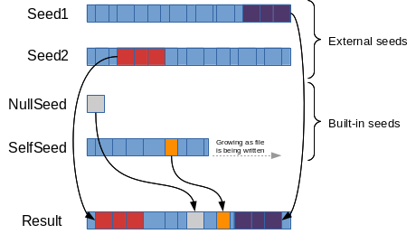

# desync

[](https://godoc.org/github.com/folbricht/desync)

This project re-implements many features of upstream [casync](https://github.com/systemd/casync) in [Go](https://golang.org/). It seeks to maintain compatibility with casync's data structures, protocols and types, such as chunk stores (castr), index files (caibx/caidx) and archives (catar) in order to function as a drop-in replacement in many use cases. It also tries to maintain support for platforms other than Linux and simplify build/installation. It consists of a [library](https://godoc.org/github.com/folbricht/desync) that implements the features, available for integration into any 3rd-party product as well as a command-line tool.

For support and discussion, see [](https://gitter.im/desync-casync-client/Lobby). Feature requests should be discussed there before filing, unless you're interested in doing the work to implement them yourself.

## Goals And Non-Goals

Among the distinguishing factors:

- Supported on MacOS, though there could be incompatibilities when exchanging catar-files between Linux and Mac for example since devices and filemodes differ slightly. \*BSD should work as well but hasn't been tested. Windows supports a subset of commands.
- Where the upstream command has chosen to optimize for storage efficiency (f/e, being able to use local files as "seeds", building temporary indexes into them), this command chooses to optimize for runtime performance (maintaining a local explicit chunk store, avoiding the need to reindex) at cost to storage efficiency.
- Where the upstream command has chosen to take full advantage of Linux platform features, this client chooses to implement a minimum featureset and, while high-value platform-specific features (such as support for btrfs reflinks into a decompressed local chunk cache) might be added in the future, the ability to build without them on other platforms will be maintained.
- Both, SHA512/256 and SHA256 are supported hash functions.
- Only chunk stores using zstd compression as well uncompressed are supported at this point.
- Supports local stores as well as remote stores (as client) over SSH, SFTP and HTTP
- Built-in HTTP(S) chunk server that can proxy multiple local or remote stores and also supports caching and deduplication for concurrent requests.
- Drop-in replacement for casync on SSH servers when serving chunks read-only
- Support for catar files exists, but ignores SELinux and ACLs that may be present in existing catar files and those won't be present when creating a new catar with the `tar` command; FCAPs are supported only as a verbatim copy of "security.capability" XAttr.
- Supports chunking with the same algorithm used by casync (see `make` command) but executed in parallel. Results are identical to what casync produces, same chunks and index files, but with significantly better performance. For example, up to 10x faster than casync if the chunks are already present in the store. If the chunks are new, it heavily depends on I/O, but it's still likely several times faster than casync.
- While casync supports very small min chunk sizes, optimizations in desync require min chunk sizes larger than the window size of the rolling hash used (currently 48 bytes). The tool's default chunk sizes match the defaults used in casync, min 16k, avg 64k, max 256k.
- Allows FUSE mounting of blob indexes
- S3/GC protocol support to access chunk stores for read operations and some some commands that write chunks
- Stores and retrieves index files from remote index stores such as HTTP, SFTP, Google Storage and S3
- Built-in HTTP(S) index server to read/write indexes
- Reflinking matching blocks (rather than copying) from seed files if supported by the filesystem (currently only Btrfs and XFS)
- catar archives can be created from standard tar archives, and they can also be extracted to GNU tar format.

## Terminology

The documentation below uses terms that may not be clear to readers not already familiar with casync.

- **chunk** - A chunk is a section of data from a file. Typically it's between 16kB and 256kB. Chunks are identified by the SHA512-256 checksum of their uncompressed data. Files are split into several chunks with the `make` command which tries to find chunk boundaries intelligently using the algorithm outlined in this [blog post](http://0pointer.net/blog/casync-a-tool-for-distributing-file-system-images.html). By default, chunks are stored as files compressed with [zstd](https://github.com/facebook/zstd) and extension `.cacnk`.
- **chunk store** - Location, either local or remote that stores chunks. In its most basic form, a chunk store can be a local directory, containing chunk files named after the checksum of the chunk. Other protocols like HTTP, S3, GC, SFTP and SSH are available as well.
- **index** - Indexes are data structures containing references to chunks and their location within a file. An index is a small representation of a much larger file. Given an index and a chunk store, it's possible to re-assemble the large file or make it available via a FUSE mount. Indexes are produced during chunking operations such as the `create` command. The most common file extension for an index is `.caibx`. When catar archives are chunked, the extension `.caidx` is used instead.
- **index store** - Index stores are used to keep index files. It could simply be a local directory, or accessed over SFTP, S3, GC or HTTP.
- **catar** - Archives of directory trees, similar to what is produced by the `tar` command. These commonly have the `.catar` extension.
- **caidx** - Index file of a chunked catar.
- **caibx** - Index of a chunked regular blob.

## Parallel chunking

One of the significant differences to casync is that desync attempts to make chunking faster by utilizing more CPU resources, chunking data in parallel. Depending on the chosen degree of concurrency, the file is split into N equal parts and each part is chunked independently. While the chunking of each part is ongoing, part1 is trying to align with part2, and part3 is trying to align with part4 and so on. Alignment is achieved once a common split point is found in the overlapping area. If a common split point is found, the process chunking the previous part stops, eg. part1 chunker stops, part2 chunker keeps going until it aligns with part3 and so on until all split points have been found. Once all split points have been determined, the file is opened again (N times) to read, compress and store the chunks. While in most cases this process achieves significantly reduced chunking times at the cost of CPU, there are edge cases where chunking is only about as fast as upstream casync (with more CPU usage). This is the case if no split points can be found in the data between min and max chunk size as is the case if most or all of the file consists of 0-bytes. In this situation, the concurrent chunking processes for each part will not align with each other and a lot of effort is wasted. The table below shows how the type of data that is being chunked can influence runtime of each operation. `make` refers to the process of chunking, while `extract` refers to re-assembly of blobs from chunks.

Command | Mostly/All 0-bytes  | Typical data
------------ | ------------- | ------------
make | Slow (worst-case) - Likely comparable to casync | Fast - Parallel chunking
extract | Extremely fast - Effectively the speed of a truncate() syscall | Fast - Done in parallel, usually limited by I/O

## Seeds and reflinks

Copy-on-write filesystems such as Btrfs and XFS support cloning of blocks between files in order to save disk space as well as improve extraction performance. To utilize this feature, desync uses several seeds to clone sections of files rather than reading the data from chunk-stores and copying it in place:

- A built-in seed for Null-chunks (a chunk of Max chunk size containing only 0 bytes). This can significantly reduce disk usage of files with large 0-byte ranges, such as VM images. This will effectively turn an eager-zeroed VM disk into a sparse disk while retaining all the advantages of eager-zeroed disk images.
- A build-in Self-seed. As chunks are being written to the destination file, the file itself becomes a seed. If one chunk, or a series of chunks is used again later in the file, it'll be cloned from the position written previously. This saves storage when the file contains several repetitive sections.
- Seed files and their indexes can be provided when extracting a file. For this feature, it's necessary to already have the index plus its blob on disk. So for example `image-v1.vmdk` and `image-v1.vmdk.caibx` can be used as seed for the extract operation of `image-v2.vmdk`. The amount of additional disk space required to store `image-v2.vmdk` will be the delta between it and `image-v1.vmdk`.



Even if cloning is not available, seeds are still useful. `desync` automatically determines if reflinks are available (and the block size used in the filesystem). If cloning is not supported, sections are copied instead of cloned. Copying still improves performance and reduces the load created by retrieving chunks over the network and decompressing them.

## Reading and writing tar streams

In addition to packing local filesystem trees into catar archives, it is possible to read a tar archive stream. Various tar formats such as GNU and BSD tar are supported. See [https://golang.org/pkg/archive/tar/](https://golang.org/pkg/archive/tar/) for details on supported formats. When reading from tar archives, the content is no re-ordered and written to the catar in the same order. This may create output files that are different when comparing to using the local filesystem as input since the order depends entirely on how the tar file is created. Since the catar format does not support hardlinks, the input tar stream needs to follow hardlinks for desync to process them correctly. See the `--hard-dereference` option in the tar utility.

catar archives can also be extracted to GNU tar archive streams. All files in the output stream are ordered the same as in the catar.

## Tool

The tool is provided for convenience. It uses the desync library and makes most features of it available in a consistent fashion. It does not match upsteam casync's syntax exactly, but tries to be similar at least.

### Installation

The following builds the binary and installs it into $HOME/go/bin by default.

```text
GO111MODULE=on go get -v github.com/folbricht/desync/cmd/desync
```

Alternative method using a clone, building from the tip of the master branch.

```text
git clone https://github.com/folbricht/desync.git
cd desync/cmd/desync && go install
```

### Subcommands

- `extract`      - build a blob from an index file, optionally using seed indexes+blobs
- `verify`       - verify the integrity of a local store
- `list-chunks`  - list all chunk IDs contained in an index file
- `cache`        - populate a cache from index files without extracting a blob or archive
- `chop`         - split a blob according to an existing caibx and store the chunks in a local store
- `pull`         - serve chunks using the casync protocol over stdin/stdout. Set `CASYNC_REMOTE_PATH=desync` on the client to use it.
- `tar`          - pack a catar file, optionally chunk the catar and create an index file.
- `untar`        - unpack a catar file or an index referencing a catar. Device entries in tar files are unsuppored and `--no-same-owner` and `--no-same-permissions` options are ignored on Windows.
- `prune`        - remove unreferenced chunks from a local, S3 or GC store. Use with caution, can lead to data loss.
- `verify-index` - verify that an index file matches a given blob
- `chunk-server` - start a HTTP(S) chunk server/store
- `index-server` - start a HTTP(S) index server/store
- `make`         - split a blob into chunks and create an index file
- `mount-index`  - FUSE mount a blob index. Will make the blob available as single file inside the mountpoint.
- `info`         - Show information about an index file, such as number of chunks and optionally chunks from an index that a re present in a store
- `mtree`        - Print the content of an archive or index in mtree-compatible format.

### Options (not all apply to all commands)

- `-s <store>` Location of the chunk store, can be local directory or a URL like ssh://hostname/path/to/store. Multiple stores can be specified, they'll be queried for chunks in the same order. The `chop`, `make`, `tar` and `prune` commands support updating chunk stores in S3, while `verify` only operates on a local store.
- `--seed <indexfile>` Specifies a seed file and index for the `extract` command. The tool expects the matching file to be present and have the same name as the index file, without the `.caibx` extension.
- `--seed-dir <dir>` Specifies a directory containing seed files and their indexes for the `extract` command. For each index file in the directory (`*.caibx`) there needs to be a matching blob without the extension.
- `-c <store>` Location of a chunk store to be used as cache. Needs to be writable.
- `-n <int>` Number of concurrent download jobs and ssh sessions to the chunk store.
- `-r` Repair a local cache by removing invalid chunks. Only valid for the `verify` command.
- `-y` Answer with `yes` when asked for confirmation. Only supported by the `prune` command.
- `-l` Listening address for the HTTP chunk server. Can be used multiple times to run on more than one interface or more than one port. Only supported by the `chunk-server` command.
- `-m` Specify the min/avg/max chunk sizes in kb. Only applicable to the `make` command. Defaults to 16:64:256 and for best results the min should be avg/4 and the max should be 4*avg.
- `-i` When packing/unpacking an archive, don't create/read an archive file but instead store/read the chunks and use an index file (caidx) for the archive. Only applicable to `tar` and `untar` commands.
- `-t` Trust all certificates presented by HTTPS stores. Allows the use of self-signed certs when using a HTTPS chunk server.
- `--key` Key file in PEM format used for HTTPS `chunk-server` and `index-server` commands. Also requires a certificate with `--cert`
- `--cert` Certificate file in PEM format used for HTTPS `chunk-server` and `index-server` commands. Also requires `-key`.
- `-k` Keep partially assembled files in place when `extract` fails or is interrupted. The command can then be restarted and it'll not have to retrieve completed parts again. Also use this option to write to block devices.

### Environment variables

- `CASYNC_SSH_PATH` overrides the default "ssh" with a command to run when connecting to a remote SSH or SFTP chunk store
- `CASYNC_REMOTE_PATH` defines the command to run on the chunk store when using SSH, default "casync"
- `S3_ACCESS_KEY`, `S3_SECRET_KEY`, `S3_SESSION_TOKEN`, `S3_REGION` can be used to define S3 store credentials if only one store is used. If `S3_ACCESS_KEY` and `S3_SECRET_KEY` are not defined, `AWS_ACCESS_KEY_ID`, `AWS_SECRET_ACCESS_KEY`, `AWS_SESSION_TOKEN` are also considered. Caution, these values take precedence over any S3 credentials set in the config file.
- `DESYNC_PROGRESSBAR_ENABLED` enables the progress bar if set to anything other than an empty string. By default, the progressbar is only turned on if STDERR is found to be a terminal.
- `DESYNC_ENABLE_PARSABLE_PROGRESS` prints in STDERR the current operation name, the completed percentage and the estimated remaining time if it is set to anything other than an empty string. This is similar to the default progress bar but without the actual bar.
- `DESYNC_HTTP_AUTH` sets the expected value in the HTTP Authorization header from clients when using `chunk-server` or `index-server`. It needs to be the full string, with type and encoding like `"Basic dXNlcjpwYXNzd29yZAo="`. Any authorization value provided in the command line takes precedence over the environment variable.

### Caching

The `-c <store>` option can be used to either specify an existing store to act as cache or to populate a new store. Whenever a chunk is requested, it is first looked up in the cache before routing the request to the next (possibly remote) store. Any chunks downloaded from the main stores are added to the cache. In addition, when a chunk is read from the cache and it is a local store, mtime of the chunk is updated to allow for basic garbage collection based on file age. The cache store is expected to be writable. If the cache contains an invalid chunk (checksum does not match the chunk ID), the operation will fail. Invalid chunks are not skipped or removed from the cache automatically. `verfiy -r` can be used to
evict bad chunks from a local store or cache.

### Multiple chunk stores

One of the main features of desync is the ability to combine/chain multiple chunk stores of different types and also combine it with a cache store. For example, for a command that reads chunks when assembling a blob, stores can be chained in the command line like so: `-s <store1> -s <store2> -s <store3>`. A chunk will first be requested from `store1`, and if not found there, the request will be routed to `<store2>` and so on. Typically, the fastest chunk store should be listed first to improve performance. It is also possible to combine multiple chunk stores with a cache. In most cases the cache would be a local store, but that is not a requirement. When combining stores and a cache like so: `-s <store1> -s <store2> -c <cache>`, a chunk request will first be routed to the cache store, then to store1 followed by store2. Any chunks that is not yet in the cache will be stored there upon first request.

Not all types of stores support all operations. The table below lists the supported operations on all store types.

| Operation | Local store | S3 store | HTTP store | SFTP | SSH (casync protocol)
| --- | :---: | :---: | :---: | :---: | :---: |
| Read chunks | yes | yes | yes | yes | yes |
| Write chunks | yes | yes | yes | yes | no |
| Use as cache | yes | yes | yes |yes | no |
| Prune | yes | yes | no | yes | no |
| Verify | yes | yes | no | no | no |

### Store failover

Given stores with identical content (same chunks in each), it is possible to group them in a way that provides resilience to failures. Store groups are specified in the command line using `|` as separator in the same `-s` option. For example using `-s "http://server1/|http://server2/"`, requests will normally be sent to `server1`, but if a failure is encountered, all subsequent requests will be routed to `server2`. There is no automatic fail-back. A failure in `server2` will cause it to switch back to `server1`. Any number of stores can be grouped this way. Note that a missing chunk is treated as a failure immediately, no other servers will be tried, hence the need for all grouped stores to hold the same content.

### Dynamic store configuration

Some long-running processes, namely `chunk-server` and `mount-index` may require a reconfiguration without having to restart them. This can be achieved by starting them with the `--store-file` options which provides the arguments that are normally passed via command line flags `--store` and `--cache` from a JSON file instead. Once the server is running, a SIGHUP to the process will trigger a reload of the configuration and replace the stores internally without restart. This can be done under load. If the configuration in the file is found to be invalid, and error is printed to STDERR and the reload ignored. The structure of the store-file is as follows:

```json
{
  "stores": [
    "/path/to/store1",
    "/path/to/store2"
  ],
  "cache": "/path/to/cache"
}
```

This can be combined with store failover by providing the same syntax as is used in the command-line, for example `{"stores":["/path/to/main|/path/to/backup"]}`, See [Examples](#examples) for details on how to use the `--store-file` option.

### Remote indexes

Indexes can be stored and retrieved from remote locations via SFTP, S3, and HTTP. Storing indexes remotely is optional and deliberately separate from chunk storage. While it's possible to store indexes in the same location as chunks in the case of SFTP and S3, this should only be done in secured environments. The built-in HTTP chunk store (`chunk-server` command) can not be used as index server. Use the `index-server` command instead to start an index server that serves indexes and can optionally store them as well (with `-w`).

Using remote indexes, it is possible to use desync completely file-less. For example when wanting to share a large file with `mount-index`, one could read the index from an index store like this:

```text
desync mount-index -s http://chunk.store/store http://index.store/myindex.caibx /mnt/image
```

No file would need to be stored on disk in this case.

### S3 chunk stores

desync supports reading from and writing to chunk stores that offer an S3 API, for example hosted in AWS or running on a local server. When using such a store, credentials are passed into the tool either via environment variables `S3_ACCESS_KEY`, `S3_SECRET_KEY` and `S3_SESSION_TOKEN` (if needed) or, if multiples are required, in the config file. Care is required when building those URLs. Below a few examples:

#### AWS

This store is hosted in `eu-west-3` in AWS. `s3` signals that the S3 protocol is to be used, `https` should be specified for SSL connections. The first path element of the URL contains the bucket, `desync.bucket` in this example. Note, when using AWS, no port should be given in the URL!

```text
s3+https://s3-eu-west-3.amazonaws.com/desync.bucket
```

It's possible to use prefixes (or "directories") to object names like so:

```text
s3+https://s3-eu-west-3.amazonaws.com/desync.bucket/prefix
```

#### Other service with S3 API

This is a store running on the local machine on port 9000 without SSL.

```text
s3+http://127.0.0.1:9000/store
```

#### Setting S3 bucket addressing style for other services

desync uses [minio](https://github.com/minio/minio-go) as an S3 client library. It has an auto-detection mechanism for determining the addressing style of the buckets which should work for Amazon and Google S3 services but could potentially fail for your custom implementation. You can manually specify the addressing style by appending the "lookup" query parameter to the URL.

By default, the value of "?lookup=auto" is implied.

```text
s3+http://127.0.0.1:9000/bucket/prefix?lookup=path
s3+https://s3.internal.company/bucket/prefix?lookup=dns
s3+https://example.com/bucket/prefix?lookup=auto
```

### Compressed vs Uncompressed chunk stores

By default, desync reads and writes chunks in compressed form to all supported stores. This is in line with upstream casync's goal of storing in the most efficient way. It is however possible to change this behavior by providing desync with a config file (see Configuration section below). Disabling compression and store chunks uncompressed may reduce latency in some use-cases and improve performance. desync supports reading and writing uncompressed chunks to SFTP, S3, HTTP and local stores and caches. If more than one store is used, each of those can be configured independently, for example it's possible to read compressed chunks from S3 while using a local uncompressed cache for best performance. However, care needs to be taken when using the `chunk-server` command and building chains of chunk store proxies to avoid shifting the decompression load onto the server (it's possible this is actually desirable).

In the setup below, a client reads chunks from an HTTP chunk server which itself gets chunks from S3.

```text
<Client> ---> <HTTP chunk server> ---> <S3 store>
```

If the client configures the HTTP chunk server to be uncompressed (`chunk-server` needs to be started with the `-u` option), and the chunk server reads compressed chunks from S3, then the chunk server will have to decompress every chunk that's requested before responding to the client. If the chunk server was reading uncompressed chunks from S3, there would be no overhead.

Compressed and uncompressed chunks can live in the same store and don't interfere with each other. A store that's configured for compressed chunks by configuring it client-side will not see the uncompressed chunks that may be present. `prune` and `verify` too will ignore any chunks written in the other format. Both kinds of chunks can be accessed by multiple clients concurrently and independently.

### Configuration

For most use cases, it is sufficient to use the tool's default configuration not requiring a config file. Having a config file `$HOME/.config/desync/config.json` allows for further customization of timeouts, error retry behaviour or credentials that can't be set via command-line options or environment variables. All values have sensible defaults if unconfigured. Only add configuration for values that differ from the defaults. To view the current configuration, use `desync config`. If no config file is present, this will show the defaults. To create a config file allowing custom values, use `desync config -w` which will write the current configuration to the file, then edit the file.

Available configuration values:

- `http-timeout` *DEPRECATED, see `store-options.<Location>.timeout`* - HTTP request timeout used in HTTP stores (not S3) in nanoseconds
- `http-error-retry` *DEPRECATED, see `store-options.<Location>.error-retry` - Number of times to retry failed chunk requests from HTTP stores
- `s3-credentials` - Defines credentials for use with S3 stores. Especially useful if more than one S3 store is used. The key in the config needs to be the URL scheme and host used for the store, excluding the path, but including the port number if used in the store URL. The key can also contain glob patterns, and the available wildcards are `*`, `?` and `[…]`. Please refer to the [filepath.Match](https://pkg.go.dev/path/filepath#Match) documentation for additional information. It is also possible to use a [standard aws credentials file](https://docs.aws.amazon.com/cli/latest/userguide/cli-config-files.html) in order to store s3 credentials.
- `store-options` - Allows customization of chunk and index stores, for example compression settings, timeouts, retry behavior and keys. Not all options are applicable to every store, some of these like `timeout` are ignored for local stores. Some of these options, such as the client certificates are overwritten with any values set in the command line. Note that the store location used in the command line needs to match the key under `store-options` exactly for these options to be used. As for the `s3-credentials`, glob patterns are also supported. A configuration file where more than one key matches a single store location, is considered invalid.
  - `timeout` - Time limit for chunk read or write operation in nanoseconds. Default: 1 minute. If set to a negative value, timeout is infinite.
  - `error-retry` - Number of times to retry failed chunk requests. Default: 0.
  - `error-retry-base-interval` - Number of nanoseconds to wait before first retry attempt. Retry attempt number N for the same request will wait N times this interval. Default: 0.
  - `client-cert` - Cerificate file to be used for stores where the server requires mutual SSL.
  - `client-key` - Key file to be used for stores where the server requires mutual SSL.
  - `ca-cert` - Certificate file containing trusted certs or CAs.
  - `trust-insecure` - Trust any certificate presented by the server.
  - `skip-verify` - Disables data integrity verification when reading chunks to improve performance. Only recommended when chaining chunk stores with the `chunk-server` command using compressed stores.
  - `uncompressed` - Reads and writes uncompressed chunks from/to this store. This can improve performance, especially for local stores or caches. Compressed and uncompressed chunks can coexist in the same store, but only one kind is read or written by one client.
  - `http-auth` - Value of the Authorization header in HTTP requests. This could be a bearer token with `"Bearer <token>"` or a Base64-encoded username and password pair for basic authentication like `"Basic dXNlcjpwYXNzd29yZAo="`.
  - `http-cookie` - Value of the Cookie header in HTTP requests. This should be in the form of a list of name-value pairs separated by a semicolon and a space (`'; '`) like `"name=value; name2=value2; name3=value3"`.

#### Example config

```json
{
  "s3-credentials": {
       "http://localhost": {
           "access-key": "MYACCESSKEY",
           "secret-key": "MYSECRETKEY"
       },
       "https://127.0.0.1:9000": {
           "aws-credentials-file": "/Users/user/.aws/credentials",
       },
       "https://127.0.0.1:8000": {
           "aws-credentials-file": "/Users/user/.aws/credentials",
           "aws-profile": "profile_static"
       },
       "https://s3.us-west-2.amazonaws.com": {
           "aws-credentials-file": "/Users/user/.aws/credentials",
           "aws-region": "us-west-2",
           "aws-profile": "profile_refreshable"
       }
  },
  "store-options": {
    "https://192.168.1.1/store": {
      "client-cert": "/path/to/crt",
      "client-key": "/path/to/key",
      "error-retry": 1
    },
    "https://10.0.0.1/": {
      "http-auth": "Bearer abcabcabc"
    },
    "https://example.com/*/*/": {
      "http-auth": "Bearer dXNlcjpwYXNzd29yZA=="
    },
    "https://cdn.example.com/": {
      "http-cookie": "PHPSESSID=298zf09hf012fh2; csrftoken=u32t4o3tb3gg43"
    },
    "/path/to/local/cache": {
      "uncompressed": true
    }
  }
}
```

#### Example aws credentials

```ini
[default]
aws_access_key_id = DEFAULT_PROFILE_KEY
aws_secret_access_key = DEFAULT_PROFILE_SECRET

[profile_static]
aws_access_key_id = OTHERACCESSKEY
aws_secret_access_key = OTHERSECRETKEY

[profile_refreshable]
aws_access_key_id = PROFILE_REFRESHABLE_KEY
aws_secret_access_key = PROFILE_REFRESHABLE_SECRET
aws_session_token = PROFILE_REFRESHABLE_TOKEN
```

### Examples

Re-assemble somefile.tar using a remote chunk store and a blob index file.

```text
desync extract -s ssh://192.168.1.1/path/to/casync.store/ -c /tmp/store somefile.tar.caibx somefile.tar
```

Use multiple stores, specify the local one first to improve performance.

```text
desync extract -s /some/local/store -s ssh://192.168.1.1/path/to/casync.store/ somefile.tar.caibx somefile.tar
```

Extract version 3 of a disk image using the previous 2 versions as seed for cloning (if supported), or copying. Note, when providing a seed like `--seed <file>.ext.caibx`, it is assumed that `<file>.ext` is available next to the index file, and matches the index.

```text
desync extract -s /local/store \
  --seed image-v1.qcow2.caibx \
  --seed image-v2.qcow2.caibx \
  image-v3.qcow2.caibx image-v3.qcow2
```

Extract an image using several seeds present in a directory. Each of the `.caibx` files in the directory needs to have a matching blob of the same name. It is possible for the source index file to be in the same directory also (it'll be skipped automatically).

```text
desync extract -s /local/store --seed-dir /path/to/images image-v3.qcow2.caibx image-v3.qcow2
```

Mix and match remote stores and use a local cache store to improve performance. Also group two identical HTTP stores with `|` to provide failover in case of errors on one.

```text
desync extract \
       -s "http://192.168.1.101/casync.store/|http://192.168.1.102/casync.store/" \
       -s ssh://192.168.1.1/path/to/casync.store/ \
       -s https://192.168.1.3/ssl.store/ \
       -c /path/to/cache \
       somefile.tar.caibx somefile.tar
```

Extract a file in-place (`-k` option). If this operation fails, the file will remain partially complete and can be restarted without the need to re-download chunks from the remote SFTP store. Use `-k` when a local cache is not available and the extract may be interrupted.

```text
desync extract -k -s sftp://192.168.1.1/path/to/store file.caibx file.tar
```

Extract an image directly onto a block device. The `-k` or `--in-place` option is needed.

```text
desync extract -k -s /mnt/store image.caibx /dev/sdc
```

Extract a file using a remote index stored in an HTTP index store

```text
desync extract -k -s sftp://192.168.1.1/path/to/store http://192.168.1.2/file.caibx file.tar
```

Verify a local cache. Errors will be reported to STDOUT, since `-r` is not given, nothing invalid will be removed.

```text
desync verify -s /some/local/store
```

Cache the chunks used in a couple of index files in a local store without actually writing the blob.

```text
desync cache -s ssh://192.168.1.1/path/to/casync.store/ -c /local/cache somefile.tar.caibx other.file.caibx
```

List the chunks referenced in a caibx.

```text
desync list-chunks somefile.tar.caibx
```

Chop an existing file according to an existing caibx and store the chunks in a local store. This can be used
to populate a local cache from a possibly large blob that already exists on the target system.

```text
desync chop -s /some/local/store somefile.tar.caibx somefile.tar
```

Chop a blob according to an existing index, while ignoring any chunks that are referenced in another index. This can be used to improve performance when it is known that all chunks referenced in `image-v1.caibx` are already present in the target store and can be ignored when chopping `image-v2.iso`.

```text
desync chop -s /some/local/store --ignore image-v1.iso.caibx image-v2.iso.caibx image-v2.iso
```

Pack a directory tree into a catar file.

```text
desync tar archive.catar /some/dir
```

Pack a directory tree into an archive and chunk the archive, producing an index file.

```text
desync tar -i -s /some/local/store archive.caidx /some/dir
```

Unpack a catar file.

```text
desync untar archive.catar /some/dir
```

Unpack a directory tree using an index file referencing a chunked archive.

```text
desync untar -i -s /some/local/store archive.caidx /some/dir
```

Pack a directory tree currently available as tar archive into a catar. The tar input stream can also be read from STDIN by providing '-' instead of the file name.

```text
desync tar --input-format=tar archive.catar /path/to/archive.tar
```

Process a tar stream into a catar. Since catar don't support hardlinks, we need to make sure those are dereferenced in the input stream.

```text
tar --hard-dereference -C /path/to/dir -c . | desync tar --input-format tar archive.catar -
```

Unpack a directory tree from an index file and store the output filesystem in a GNU tar file rather than the local filesystem. Instead of an archive file, the output can be given as '-' which will write to STDOUT.

```text
desync untar -i -s /some/local/store --output-format=gnu-tar archive.caidx /path/to/archive.tar
```

Prune a store to only contain chunks that are referenced in the provided index files. Possible data loss.

```text
desync prune -s /some/local/store index1.caibx index2.caibx
```

Start a chunk server serving up a local store via port 80.

```text
desync chunk-server -s /some/local/store
```

Start a chunk server on port 8080 acting as proxy for other remote HTTP and SSH stores and populate a local cache.

```text
desync chunk-server -s http://192.168.1.1/ -s ssh://192.168.1.2/store -c cache -l :8080
```

Start a chunk server with a store-file, this allows the configuration to be re-read on SIGHUP without restart.

```text
# Create store file
echo '{"stores": ["http://192.168.1.1/"], "cache": "/tmp/cache"}` > stores.json

# Start the server
desync chunk-server --store-file stores.json -l :8080

# Modify
echo '{"stores": ["http://192.168.1.2/"], "cache": "/tmp/cache"}` > stores.json

# Reload
killall -1 desync
```

Start a writable index server, chunk a file and store the index.

```text
server# desync index-server -s /mnt/indexes --writable -l :8080

client# desync make -s /some/store http://192.168.1.1:8080/file.vmdk.caibx file.vmdk
```

Copy all chunks referenced in an index file from a remote HTTP store to a remote SFTP store.

```text
desync cache -s ssh://192.168.1.2/store -c sftp://192.168.1.3/path/to/store /path/to/index.caibx
```

Start a TLS chunk server on port 443 acting as proxy for a remote chunk store in AWS with local cache. The credentials for AWS are expected to be in the config file under key `https://s3-eu-west-3.amazonaws.com`.

```text
desync chunk-server -s s3+https://s3-eu-west-3.amazonaws.com/desync.bucket/prefix -c cache -l 127.0.0.1:https --cert cert.pem --key key.pem
```

Split a blob, store the chunks and create an index file.

```text
desync make -s /some/local/store index.caibx /some/blob
```

Split a blob, create an index file and store the chunks in an S3 bucket named `store`.

```text
S3_ACCESS_KEY=mykey S3_SECRET_KEY=mysecret desync make -s s3+http://127.0.0.1:9000/store index.caibx /some/blob
```

FUSE mount an index file. This will make the indexed blob available as file underneath the mount point. The filename in the mount matches the name of the index with the extension removed. In this example `/some/mnt/` will contain one file `index`.

```text
desync mount-index -s /some/local/store index.caibx /some/mnt
```

FUSE mount a chunked and remote index file. First a (small) index file is read from the index-server which is used to re-assemble a larger index file and pipe it into the 2nd command that then mounts it.

```text
desync cat -s http://192.168.1.1/store http://192.168.1.2/small.caibx | desync mount-index -s http://192.168.1.1/store - /mnt/point
```

Long-running FUSE mount that may need to have its store setup changed without unmounting. This can be done by using the `--store-file` option rather than speicifying store+cache in the command line. The process will then reload the file when a SIGHUP is sent.

```text
# Create the store file
echo '{"stores": ["http://192.168.1.1/"], "cache": "/tmp/cache"}` > stores.json

# Start the mount
desync mount-index --store-file stores.json index.caibx /some/mnt

# Modify the store setup
echo '{"stores": ["http://192.168.1.2/"], "cache": "/tmp/cache"}` > stores.json

# Reload
killall -1 desync
```

Show information about an index file to see how many of its chunks are present in a local store or an S3 store. The local store is queried first, S3 is only queried if the chunk is not present in the local store. The output will be in JSON format (`--format=json`) for easier processing in scripts.

```text
desync info --format=json -s /tmp/store -s s3+http://127.0.0.1:9000/store /path/to/index
```

Start an HTTP chunk server that will store uncompressed chunks locally, configured via JSON config file, and serve uncompressed chunks over the network (`-u` option). This chunk server could be used as a cache, minimizing latency by storing and serving uncompressed chunks. Clients will need to be configured to request uncompressed chunks from this server.

```text
# Chunk server
echo '{"store-options": {"/path/to/store/":{"uncompressed": true}}}' > /path/to/server.json

desync --config /path/to/server.json chunk-server -w -u -s /path/to/store/ -l :8080

# Client
echo '{"store-options": {"http://store.host:8080/":{"uncompressed": true}}}' > /path/to/client.json

desync --config /path/to/client.json cache -s sftp://remote.host/store -c http://store.host:8080/ /path/to/blob.caibx
```

HTTP chunk server using basic authorization. The server is configured to expect an `Authorization` header with the correct value in every request. The client configuration defines what the value should be on a per-server basis. The client config could be added to the default `$HOME/.config/desync/config.json` instead.

```text
# Server
DESYNC_HTTP_AUTH="Bearer abcabcabc" desync chunk-server -s /path/to/store -l :8080

# Client
echo '{"store-options": {"http://127.0.0.1:8080/":{"http-auth": "Bearer abcabcabc"}}}' > /path/to/client.json

desync --config /path/to/client.json extract -s http://127.0.0.1:8080/ /path/to/blob.caibx /path/to/blob

```

HTTPS chunk server using key and certificate signed by custom CA.

```text
# Building the CA and server certficate
openssl genrsa -out ca.key 4096
openssl req -x509 -new -nodes -key ca.key -sha256 -days 3650 -out ca.crt
openssl genrsa -out server.key 2048
openssl req -new -key server.key -out server.csr (Common Name should be the server name)
openssl x509 -req -in server.csr -CA ca.crt -CAkey ca.key -CAcreateserial -out server.crt -days 3650 -sha256

# Chunk server
desync chunk-server -s /path/to/store --key server.key --cert server.crt -l :8443

# Client
desync extract --ca-cert ca.crt -s https://hostname:8443/ image.iso.caibx image.iso
```

HTTPS chunk server with client authentication (mutual-TLS).

```text
# Building the CA, server and client certficates
openssl genrsa -out ca.key 4096
openssl req -x509 -new -nodes -key ca.key -sha256 -days 3650 -out ca.crt
openssl genrsa -out server.key 2048
openssl req -new -key server.key -out server.csr (Common Name should be the server name)
openssl x509 -req -in server.csr -CA ca.crt -CAkey ca.key -CAcreateserial -out server.crt -days 3650 -sha256
openssl genrsa -out client.key 2048
openssl req -new -key client.key -out client.csr
openssl x509 -req -in client.csr -CA ca.crt -CAkey ca.key -CAcreateserial -out client.crt -days 3650 -sha256

# Chunk server
desync chunk-server -s /path/to/store --key server.key --cert server.crt --mutual-tls --client-ca ca.crt -l :8443

# Client
desync extract --client-key client.key --client-cert client.crt --ca-cert ca.crt -s https://hostname:8443/ image.iso.caibx image.iso
```

## Links

- casync - [https://github.com/systemd/casync](https://github.com/systemd/casync)
