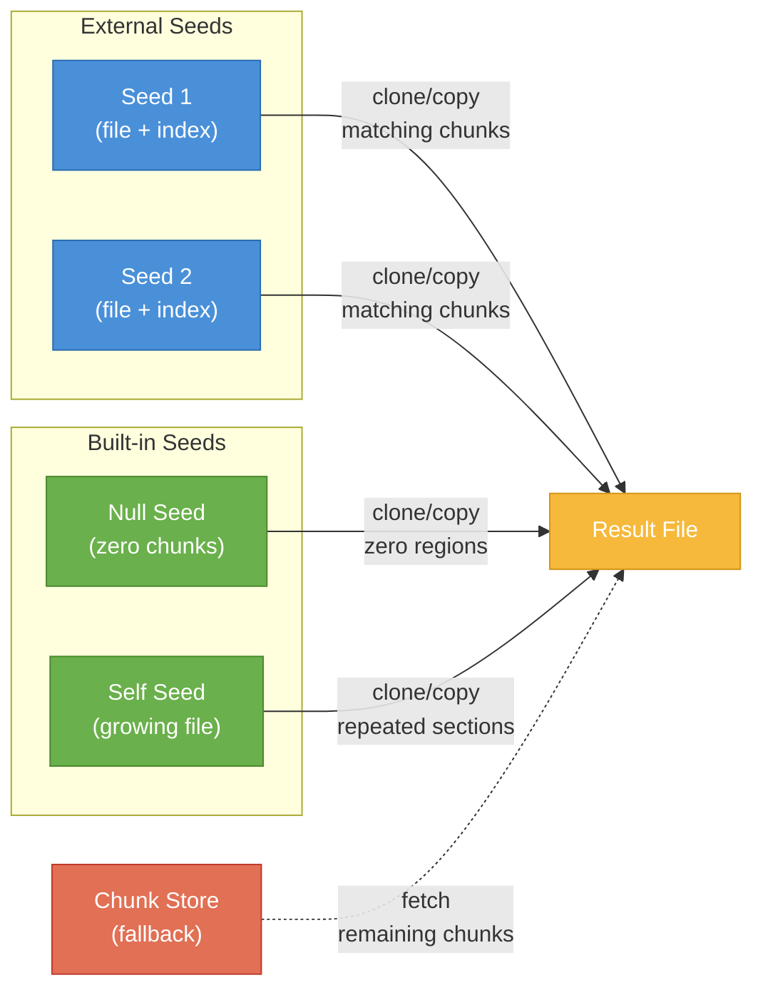
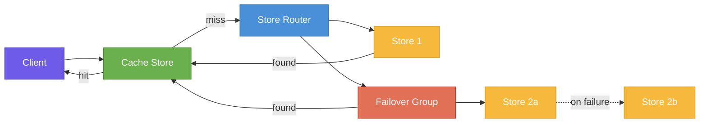

# desync

Content-addressed binary distribution, reimplemented in Go.

[](https://pkg.go.dev/github.com/folbricht/desync)
[](https://github.com/folbricht/desync/actions/workflows/validate.yaml)
[](LICENSE)

desync is a Go library and CLI tool that re-implements [casync](https://github.com/systemd/casync) features for content-addressed binary distribution. It chunks large files using a rolling hash, deduplicates and compresses chunks with [zstd](https://github.com/facebook/zstd), and distributes them via multiple store backends. It maintains compatibility with casync's data structures, protocols and types (chunk stores, index files, archives) to function as a drop-in replacement.

## Key Features

- **Parallel chunking** — identical output to casync, up to 10x faster
- **Multiple store backends** — local, HTTP(S), S3/GCS, SFTP, SSH
- **Store chaining and caching** — combine stores with failover groups
- **Seeds and reflinks** — clone blocks from existing files on Btrfs/XFS
- **Built-in servers** — HTTP(S) chunk server and index server with proxy support
- **FUSE mounting** — mount blob indexes as files
- **Tar interoperability** — create/extract catar from standard tar streams
- **Cross-platform** — Linux, macOS, Windows (subset), BSD

## Table of Contents

- [Installation](#installation)
- [Quick Start](#quick-start)
- [Concepts](#concepts)
  - [Terminology](#terminology)
  - [Parallel Chunking](#parallel-chunking)
  - [Seeds and Reflinks](#seeds-and-reflinks)
  - [Tar Interoperability](#tar-interoperability)
- [Store Backends](#store-backends)
  - [Capabilities](#capabilities)
  - [Store Architecture](#store-architecture)
  - [Chaining and Caching](#chaining-and-caching)
  - [Failover Groups](#failover-groups)
  - [S3 Store URLs](#s3-store-urls)
  - [Compressed vs Uncompressed](#compressed-vs-uncompressed)
  - [Remote Indexes](#remote-indexes)
- [CLI Reference](#cli-reference)
  - [Commands](#commands)
  - [Common Options](#common-options)
  - [Environment Variables](#environment-variables)
- [Configuration](#configuration)
  - [Dynamic Store Configuration](#dynamic-store-configuration)
  - [Configuration Reference](#configuration-reference)
  - [Example Config](#example-config)
- [Examples](#examples)
  - [Extraction](#extraction)
  - [Chunking](#chunking)
  - [Cache and Store Management](#cache-and-store-management)
  - [Archives](#archives)
  - [Server Examples](#server-examples)
  - [Update Size Estimation](#update-size-estimation)
- [Platform Support](#platform-support)
- [Design Philosophy](#design-philosophy)
- [Links](#links)

## Installation

Install the latest release into `$HOME/go/bin`:

```text
go install -v github.com/folbricht/desync/cmd/desync@latest
```

Or build from source:

```text
git clone https://github.com/folbricht/desync.git
cd desync/cmd/desync && go install
```

## Quick Start

**Chunk a file** — split a blob into chunks and create an index:

```text
desync make -s /tmp/store index.caibx /path/to/largefile
```

**Extract a file** — reassemble a blob from its index and chunk store:

```text
desync extract -s /tmp/store index.caibx /path/to/largefile
```

**Extract with remote store and local cache** — fetch chunks over HTTP, cache locally:

```text
desync extract -s http://server/store -c /tmp/cache index.caibx /path/to/largefile
```

## Concepts

### Terminology

| Term | Description |
| --- | --- |
| **chunk** | A section of data from a file, typically 16KB-256KB. Identified by the SHA512-256 checksum of its uncompressed data. Stored compressed with zstd (`.cacnk` extension). Boundaries are determined by a [rolling hash algorithm](http://0pointer.net/blog/casync-a-tool-for-distributing-file-system-images.html). |
| **chunk store** | Location (local or remote) that stores chunks. Can be a local directory, or accessed via HTTP, S3, GCS, SFTP, or SSH. |
| **index** | Data structure mapping chunk IDs to byte offsets within a file. A small representation of a much larger file. Produced by `make`. Given an index and a chunk store, the original file can be reassembled or FUSE-mounted. |
| **index store** | Location for index files. Can be local, SFTP, S3, GCS, or HTTP. |
| **catar** | Archive of a directory tree, similar to tar (`.catar` extension). |
| **caidx** | Index file of a chunked catar archive. |
| **caibx** | Index of a chunked regular blob. |

### Parallel Chunking

One of the significant differences to casync is that desync attempts to make chunking faster by utilizing more CPU resources, chunking data in parallel. Depending on the chosen degree of concurrency, the file is split into N equal parts and each part is chunked independently. While the chunking of each part is ongoing, part1 is trying to align with part2, and part3 is trying to align with part4 and so on. Alignment is achieved once a common split point is found in the overlapping area. If a common split point is found, the process chunking the previous part stops, e.g. part1 chunker stops, part2 chunker keeps going until it aligns with part3 and so on until all split points have been found. Once all split points have been determined, the file is opened again (N times) to read, compress and store the chunks.

While in most cases this process achieves significantly reduced chunking times at the cost of CPU, there are edge cases where chunking is only about as fast as upstream casync (with more CPU usage). This is the case if no split points can be found in the data between min and max chunk size as is the case if most or all of the file consists of 0-bytes. In this situation, the concurrent chunking processes for each part will not align with each other and a lot of effort is wasted.

| Command | Mostly/All 0-bytes | Typical data |
| --- | --- | --- |
| `make` | Slow (worst-case) — likely comparable to casync | Fast — parallel chunking |
| `extract` | Extremely fast — effectively the speed of a `truncate()` syscall | Fast — done in parallel, usually limited by I/O |

While casync supports very small min chunk sizes, optimizations in desync require min chunk sizes larger than the window size of the rolling hash used (currently 48 bytes). The tool's default chunk sizes match the defaults used in casync: min 16KB, avg 64KB, max 256KB.

### Seeds and Reflinks

Copy-on-write filesystems such as Btrfs and XFS support cloning of blocks between files in order to save disk space as well as improve extraction performance. To utilize this feature, desync uses several seeds to clone sections of files rather than reading the data from chunk stores and copying it in place:

- **Null Seed** — a built-in seed for chunks of max size containing only 0 bytes. This can significantly reduce disk usage of files with large 0-byte ranges, such as VM images, effectively turning an eager-zeroed VM disk into a sparse disk.
- **Self Seed** — as chunks are written to the destination file, the file itself becomes a seed. If a chunk or series of chunks appears again later in the file, it is cloned from the position written previously, saving storage for files with repetitive sections.
- **File Seeds** — seed files and their indexes can be provided when extracting. For example, `image-v1.vmdk` and `image-v1.vmdk.caibx` can be used as seed for extracting `image-v2.vmdk`. The additional disk space required will be only the delta between the two versions.


```mermaid
graph LR
    subgraph "External Seeds"
        S1["Seed 1<br/>(file + index)"]
        S2["Seed 2<br/>(file + index)"]
    end

    subgraph "Built-in Seeds"
        NS["Null Seed<br/>(zero chunks)"]
        SS["Self Seed<br/>(growing file)"]
    end

    CS["Chunk Store<br/>(fallback)"]

    Result["Result File"]

    S1 -- "clone/copy<br/>matching chunks" --> Result
    S2 -- "clone/copy<br/>matching chunks" --> Result
    NS -- "clone/copy<br/>zero regions" --> Result
    SS -- "clone/copy<br/>repeated sections" --> Result
    CS -. "fetch<br/>remaining chunks" .-> Result

    style S1 fill:#4a90d9,stroke:#2a6cb0,color:#fff
    style S2 fill:#4a90d9,stroke:#2a6cb0,color:#fff
    style NS fill:#6ab04c,stroke:#4a8a2c,color:#fff
    style SS fill:#6ab04c,stroke:#4a8a2c,color:#fff
    style CS fill:#e17055,stroke:#c0392b,color:#fff
    style Result fill:#f6b93b,stroke:#d4951a,color:#fff
```

Even if cloning is not available, seeds are still useful. desync automatically determines if reflinks are available (and the block size used in the filesystem). If cloning is not supported, sections are copied instead of cloned. Copying still improves performance and reduces the load created by retrieving chunks over the network and decompressing them.

### Tar Interoperability

In addition to packing local filesystem trees into catar archives, desync can read standard tar archive streams. Various tar formats such as GNU and BSD tar are supported. See the Go [archive/tar](https://pkg.go.dev/archive/tar) package for details on supported formats. When reading from tar archives, the content is not re-ordered and written to the catar in the same order. Since the catar format does not support hardlinks, the input tar stream needs to follow hardlinks for desync to process them correctly. See the `--hard-dereference` option in the tar utility.

catar archives can also be extracted to GNU tar archive streams. All files in the output stream are ordered the same as in the catar.

## Store Backends

### Capabilities

| Operation | Local | S3 | GCS | HTTP | SFTP | SSH (casync protocol) |
| --- | :---: | :---: | :---: | :---: | :---: | :---: |
| Read chunks | yes | yes | yes | yes | yes | yes |
| Write chunks | yes | yes | yes | yes | yes | no |
| Use as cache | yes | yes | yes | yes | yes | no |
| Prune | yes | yes | yes | no | yes | no |
| Verify | yes | no | no | no | no | no |

### Store Architecture


```mermaid
graph LR
    Client["Client"]
    Cache["Cache Store"]
    Router["Store Router"]
    S1["Store 1"]
    FG["Failover Group"]
    S2a["Store 2a"]
    S2b["Store 2b"]

    Client --> Cache
    Cache -- "miss" --> Router
    Cache -- "hit" --> Client
    Router --> S1
    Router --> FG
    FG --> S2a
    S2a -. "on failure" .-> S2b
    S1 -- "found" --> Cache
    FG -- "found" --> Cache

    style Client fill:#6c5ce7,stroke:#4b3ec4,color:#fff
    style Cache fill:#6ab04c,stroke:#4a8a2c,color:#fff
    style Router fill:#4a90d9,stroke:#2a6cb0,color:#fff
    style S1 fill:#f6b93b,stroke:#d4951a,color:#fff
    style FG fill:#e17055,stroke:#c0392b,color:#fff
    style S2a fill:#f6b93b,stroke:#d4951a,color:#fff
    style S2b fill:#f6b93b,stroke:#d4951a,color:#fff
```

### Chaining and Caching

One of the main features of desync is the ability to combine/chain multiple chunk stores of different types and also combine it with a cache store. Stores are chained in the command line like so: `-s <store1> -s <store2> -s <store3>`. A chunk will first be requested from `store1`, and if not found there, the request will be routed to `store2` and so on. Typically, the fastest chunk store should be listed first to improve performance.

It is also possible to combine multiple chunk stores with a cache. In most cases the cache would be a local store, but that is not a requirement. When combining stores and a cache like so: `-s <store1> -s <store2> -c <cache>`, a chunk request will first be routed to the cache store, then to store1 followed by store2. Any chunk that is not yet in the cache will be stored there upon first request.

The `-c <store>` option can be used to either specify an existing store to act as cache or to populate a new store. Whenever a chunk is requested, it is first looked up in the cache before routing the request to the next (possibly remote) store. Any chunks downloaded from the main stores are added to the cache. In addition, when a chunk is read from the cache and it is a local store, mtime of the chunk is updated to allow for basic garbage collection based on file age. The cache store is expected to be writable. If the cache contains an invalid chunk (checksum does not match the chunk ID), the operation will fail. Invalid chunks are not skipped or removed from the cache automatically. `verify -r` can be used to evict bad chunks from a local store or cache.

### Failover Groups

Given stores with identical content (same chunks in each), it is possible to group them in a way that provides resilience to failures. Store groups are specified in the command line using `|` as separator in the same `-s` option. For example using `-s "http://server1/|http://server2/"`, requests will normally be sent to `server1`, but if a failure is encountered, all subsequent requests will be routed to `server2`. There is no automatic fail-back. A failure in `server2` will cause it to switch back to `server1`. Any number of stores can be grouped this way. Note that a missing chunk is treated as a failure immediately, no other servers will be tried, hence the need for all grouped stores to hold the same content.

<details>
<summary><h3>S3 Store URLs</h3></summary>

desync supports reading from and writing to chunk stores that offer an S3 API, for example hosted in AWS or running on a local server. When using such a store, credentials are passed into the tool either via environment variables `S3_ACCESS_KEY`, `S3_SECRET_KEY` and `S3_SESSION_TOKEN` (if needed) or, if multiples are required, in the config file. Care is required when building those URLs. Below a few examples:

#### AWS

This store is hosted in `eu-west-3` in AWS. `s3` signals that the S3 protocol is to be used, `https` should be specified for SSL connections. The first path element of the URL contains the bucket, `desync.bucket` in this example. Note, when using AWS, no port should be given in the URL!

```text
s3+https://s3-eu-west-3.amazonaws.com/desync.bucket
```

It's possible to use prefixes (or "directories") to object names like so:

```text
s3+https://s3-eu-west-3.amazonaws.com/desync.bucket/prefix
```

#### Other service with S3 API

This is a store running on the local machine on port 9000 without SSL.

```text
s3+http://127.0.0.1:9000/store
```

#### Setting S3 bucket addressing style

desync uses [minio](https://github.com/minio/minio-go) as an S3 client library. It has an auto-detection mechanism for determining the addressing style of the buckets which should work for Amazon and Google S3 services but could potentially fail for your custom implementation. You can manually specify the addressing style by appending the "lookup" query parameter to the URL.

By default, the value of `?lookup=auto` is implied.

```text
s3+http://127.0.0.1:9000/bucket/prefix?lookup=path
s3+https://s3.internal.company/bucket/prefix?lookup=dns
s3+https://example.com/bucket/prefix?lookup=auto
```

</details>

<details>
<summary><h3>Compressed vs Uncompressed</h3></summary>

By default, desync reads and writes chunks in compressed form to all supported stores. This is in line with upstream casync's goal of storing in the most efficient way. It is however possible to change this behavior by providing desync with a config file (see [Configuration](#configuration)). Disabling compression and storing chunks uncompressed may reduce latency in some use-cases and improve performance. desync supports reading and writing uncompressed chunks to SFTP, S3, HTTP and local stores and caches. If more than one store is used, each of those can be configured independently, for example it's possible to read compressed chunks from S3 while using a local uncompressed cache for best performance. However, care needs to be taken when using the `chunk-server` command and building chains of chunk store proxies to avoid shifting the decompression load onto the server (it's possible this is actually desirable).

In the setup below, a client reads chunks from an HTTP chunk server which itself gets chunks from S3.

```text
<Client> ---> <HTTP chunk server> ---> <S3 store>
```

If the client configures the HTTP chunk server to be uncompressed (`chunk-server` needs to be started with the `-u` option), and the chunk server reads compressed chunks from S3, then the chunk server will have to decompress every chunk that's requested before responding to the client. If the chunk server was reading uncompressed chunks from S3, there would be no overhead.

Compressed and uncompressed chunks can live in the same store and don't interfere with each other. A store that's configured for compressed chunks by configuring it client-side will not see the uncompressed chunks that may be present. `prune` and `verify` too will ignore any chunks written in the other format. Both kinds of chunks can be accessed by multiple clients concurrently and independently.

</details>

### Remote Indexes

Indexes can be stored and retrieved from remote locations via SFTP, S3, and HTTP. Storing indexes remotely is optional and deliberately separate from chunk storage. While it's possible to store indexes in the same location as chunks in the case of SFTP and S3, this should only be done in secured environments. The built-in HTTP chunk store (`chunk-server` command) can not be used as index server. Use the `index-server` command instead to start an index server that serves indexes and can optionally store them as well (with `-w`).

Using remote indexes, it is possible to use desync completely file-less. For example when wanting to share a large file with `mount-index`, one could read the index from an index store like this:

```text
desync mount-index -s http://chunk.store/store http://index.store/myindex.caibx /mnt/image
```

No file would need to be stored on disk in this case.

## CLI Reference

The CLI tool uses the desync library and makes most features available in a consistent fashion. It does not match upstream casync's syntax exactly, but tries to be similar.

### Commands

#### Chunking and Extraction

| Command | Description |
| --- | --- |
| `make` | Split a blob into chunks and create an index file |
| `extract` | Build a blob from an index file, optionally using seed indexes+blobs |
| `verify-index` | Verify that an index file matches a given blob |
| `mount-index` | FUSE mount a blob index as a single file |
| `cat` | Stream a blob to stdout or a file |
| `chunk` | Chunk input file and print chunk boundaries plus chunk IDs |

#### Archives

| Command | Description |
| --- | --- |
| `tar` | Pack a catar file, optionally chunk and create an index |
| `untar` | Unpack a catar file or index referencing a catar |
| `mtree` | Print the content of a catar, caidx, or local directory in mtree format |

#### Servers

| Command | Description |
| --- | --- |
| `chunk-server` | Start an HTTP(S) chunk server/store |
| `index-server` | Start an HTTP(S) index server/store |
| `pull` | Serve chunks using the casync protocol over stdin/stdout |

#### Inspection

| Command | Description |
| --- | --- |
| `info` | Show information about an index file |
| `inspect-chunks` | Show detailed information about chunks in an index and optional local store |
| `list-chunks` | List all chunk IDs in an index file |

#### Maintenance

| Command | Description |
| --- | --- |
| `verify` | Verify the integrity of a local store |
| `cache` | Populate a cache from index files without extracting |
| `chop` | Split a blob according to an existing index and store chunks |
| `prune` | Remove unreferenced chunks from a store (use with caution) |

#### Utility

| Command | Description |
| --- | --- |
| `config` | Show or write the config file |
| `manpage` | Generate manpages for desync |

<details>
<summary><h3>Common Options</h3></summary>

Not all options apply to all commands.

**Global options:**

| Option | Description |
| --- | --- |
| `--config <file>` | Path to config file. Default: `$HOME/.config/desync/config.json`. |
| `--digest <algorithm>` | Digest algorithm: `sha512-256` (default) or `sha256`. |
| `--verbose` | Enable verbose/debug logging. |

**Store options:**

| Option | Description |
| --- | --- |
| `-s <store>` | Location of the chunk store, can be local directory or a URL like `ssh://hostname/path/to/store`. Multiple stores can be specified, they'll be queried in order. The `chop`, `make`, `tar` and `prune` commands support updating chunk stores in S3, while `verify` only operates on a local store. |
| `-c <store>` | Location of a chunk store to be used as cache. Needs to be writable. |
| `-n <int>` | Number of concurrent goroutines. Default: 10. |
| `-t` | Trust all certificates presented by HTTPS stores. Allows the use of self-signed certs. |
| `--ca-cert <file>` | Trust authorities in this file instead of the OS trust store. |
| `--client-cert <file>` | Client certificate for mutual TLS authentication. |
| `--client-key <file>` | Client key for mutual TLS authentication. |
| `-e` / `--error-retry <int>` | Number of times to retry on network error. |
| `-b` / `--error-retry-base-interval <duration>` | Initial retry delay; attempt N waits N times this interval. |

**Extract options:**

| Option | Description |
| --- | --- |
| `--seed <indexfile>` | Specifies a seed file and index for the `extract` command. The tool expects the matching file to have the same name as the index file, without the `.caibx` extension. |
| `--seed-dir <dir>` | Specifies a directory containing seed files and their indexes for `extract`. Each index file (`*.caibx`) needs a matching blob without the extension. |
| `-k` / `--in-place` | Keep partially assembled files in place when `extract` fails or is interrupted. Also use this option to write to block devices. |
| `--print-stats` | Print extraction statistics (`extract`) or chunking statistics (`make`) to stderr. |
| `--skip-invalid-seeds` | Skip seeds with invalid chunks instead of failing. |
| `--regenerate-invalid-seeds` | Regenerate seed indexes when invalid chunks are found. |

**Chunking and archive options:**

| Option | Description |
| --- | --- |
| `-m` | Specify the min/avg/max chunk sizes in KB. Only applicable to `make`. Defaults to 16:64:256. For best results: min = avg/4, max = 4*avg. |
| `-i` | When packing/unpacking an archive, don't create/read an archive file but instead use an index file (caidx). Only applicable to `tar` and `untar`. |
| `--input-format <format>` | Input format for `tar`: `disk` (default) or `tar`. |
| `--output-format <format>` | Output format for `untar`: `disk` (default) or `gnu-tar`. |
| `--ignore <indexfile>` | Index file(s) whose chunks should be skipped. Applies to `chop` and `cache`. |

**Server options:**

| Option | Description |
| --- | --- |
| `-l <address>` | Listening address for the HTTP chunk server. Can be used multiple times for more than one interface or port. |
| `-w` / `--writeable` | Enable write support. Applies to `chunk-server` and `index-server`. |
| `-u` / `--uncompressed` | Serve uncompressed chunks. Applies to `chunk-server`. |
| `--store-file <file>` | Read store arguments from a JSON file; supports SIGHUP reload. Applies to `chunk-server` and `mount-index`. |
| `--key <file>` | Key file in PEM format for HTTPS `chunk-server` and `index-server`. Requires `--cert`. |
| `--cert <file>` | Certificate file in PEM format for HTTPS `chunk-server` and `index-server`. Requires `--key`. |
| `--mutual-tls` | Require a valid client certificate. Applies to `chunk-server` and `index-server`. |
| `--client-ca <file>` | Acceptable client certificate or CA for mutual TLS. |
| `--authorization <value>` | Expected value of the Authorization header in client requests. |
| `--log <file>` | Request log file, or `-` for STDOUT. Applies to `chunk-server` and `index-server`. |

**Other options:**

| Option | Description |
| --- | --- |
| `-r` | Repair a local store by removing invalid chunks. Only valid for `verify`. |
| `-y` | Answer with `yes` when asked for confirmation. Only supported by `prune`. |
| `-f` / `--format <format>` | Output format for `info`: `plain` (default) or `json`. |

</details>

<details>
<summary><h3>Environment Variables</h3></summary>

| Variable | Description |
| --- | --- |
| `CASYNC_SSH_PATH` | Overrides the default `ssh` command when connecting to remote SSH or SFTP chunk stores. |
| `CASYNC_REMOTE_PATH` | Defines the command to run on the chunk store when using SSH. Default: `casync`. |
| `S3_ACCESS_KEY`, `S3_SECRET_KEY`, `S3_SESSION_TOKEN`, `S3_REGION` | S3 store credentials when using a single store. If `S3_ACCESS_KEY` and `S3_SECRET_KEY` are not defined, `AWS_ACCESS_KEY_ID`, `AWS_SECRET_ACCESS_KEY`, `AWS_SESSION_TOKEN` are also considered. These take precedence over config file values. |
| `DESYNC_PROGRESSBAR_ENABLED` | Enables the progress bar if set to any non-empty value. By default, the progress bar is only shown when STDERR is a terminal. |
| `DESYNC_ENABLE_PARSABLE_PROGRESS` | Prints operation name, completion percentage, and estimated remaining time to STDERR. Similar to the default progress bar but without the visual bar. |
| `DESYNC_HTTP_AUTH` | Sets the expected `Authorization` header value from clients when using `chunk-server` or `index-server`. Needs the full string including type and encoding, e.g. `"Basic dXNlcjpwYXNzd29yZAo="`. Command-line values take precedence. |

</details>

## Configuration

For most use cases, the tool's default configuration is sufficient. A config file at `$HOME/.config/desync/config.json` allows customization of timeouts, error retry behavior, or credentials that can't be set via command-line options or environment variables. All values have sensible defaults. Only add configuration for values that differ from the defaults.

To view the current configuration, use `desync config`. If no config file is present, this shows the defaults. To create a config file, use `desync config -w` to write the current configuration, then edit the file.

### Dynamic Store Configuration

Some long-running processes, namely `chunk-server` and `mount-index`, may require reconfiguration without restart. This can be achieved by starting them with the `--store-file` option which provides the arguments normally passed via `--store` and `--cache` from a JSON file instead. A SIGHUP to the process will trigger a reload of the configuration and replace the stores internally without restart. This can be done under load. If the configuration is found to be invalid, an error is printed to STDERR and the reload is ignored.

```json
{
  "stores": [
    "/path/to/store1",
    "/path/to/store2"
  ],
  "cache": "/path/to/cache"
}
```

This can be combined with store failover by providing the same syntax as used in the command-line, for example `{"stores":["/path/to/main|/path/to/backup"]}`. See [Server Examples](#server-examples) for details.

<details>
<summary><h3>Configuration Reference</h3></summary>

- **`s3-credentials`** — Credentials for S3 stores. The key must be the URL scheme and host used for the store, excluding the path, but including the port if used in the store URL. Keys can contain glob patterns (`*`, `?`, `[…]`). See [filepath.Match](https://pkg.go.dev/path/filepath#Match) for wildcard details. Standard [AWS credentials files](https://docs.aws.amazon.com/cli/latest/userguide/cli-config-files.html) are also supported.

- **`store-options`** — Per-store customization of compression, timeouts, retry behavior, and keys. Not all options apply to every store type. The store location in the command line must match the key exactly for options to apply. Glob patterns are also supported; a config file where more than one key matches a single store is considered invalid.

  | Option | Description | Default |
  | --- | --- | --- |
  | `timeout` | Time limit for chunk read/write in nanoseconds. Negative = infinite. | 1 minute |
  | `error-retry` | Number of times to retry failed chunk requests. | 0 |
  | `error-retry-base-interval` | Nanoseconds to wait before first retry. Attempt N waits N times this interval. | 0 |
  | `client-cert` | Certificate file for mutual SSL. | — |
  | `client-key` | Key file for mutual SSL. | — |
  | `ca-cert` | Certificate file containing trusted certs or CAs. | — |
  | `trust-insecure` | Trust any certificate presented by the server. | false |
  | `skip-verify` | Disable data integrity verification on read. Only recommended when chaining stores with `chunk-server` using compressed stores. | false |
  | `uncompressed` | Read and write uncompressed chunks. Both formats can coexist in the same store. | false |
  | `http-auth` | Value of the `Authorization` header in HTTP requests, e.g. `"Bearer <token>"` or `"Basic dXNlcjpwYXNzd29yZAo="`. | — |
  | `http-cookie` | Value of the `Cookie` header in HTTP requests, e.g. `"name=value; name2=value2"`. | — |

</details>

<details>
<summary><h3>Example Config</h3></summary>

#### JSON config file

```json
{
  "s3-credentials": {
       "http://localhost": {
           "access-key": "MYACCESSKEY",
           "secret-key": "MYSECRETKEY"
       },
       "https://127.0.0.1:9000": {
           "aws-credentials-file": "/Users/user/.aws/credentials"
       },
       "https://127.0.0.1:8000": {
           "aws-credentials-file": "/Users/user/.aws/credentials",
           "aws-profile": "profile_static"
       },
       "https://s3.us-west-2.amazonaws.com": {
           "aws-credentials-file": "/Users/user/.aws/credentials",
           "aws-region": "us-west-2",
           "aws-profile": "profile_refreshable"
       }
  },
  "store-options": {
    "https://192.168.1.1/store": {
      "client-cert": "/path/to/crt",
      "client-key": "/path/to/key",
      "error-retry": 1
    },
    "https://10.0.0.1/": {
      "http-auth": "Bearer abcabcabc"
    },
    "https://example.com/*/*/": {
      "http-auth": "Bearer dXNlcjpwYXNzd29yZA=="
    },
    "https://cdn.example.com/": {
      "http-cookie": "PHPSESSID=298zf09hf012fh2; csrftoken=u32t4o3tb3gg43"
    },
    "/path/to/local/cache": {
      "uncompressed": true
    }
  }
}
```

#### AWS credentials file

```ini
[default]
aws_access_key_id = DEFAULT_PROFILE_KEY
aws_secret_access_key = DEFAULT_PROFILE_SECRET

[profile_static]
aws_access_key_id = OTHERACCESSKEY
aws_secret_access_key = OTHERSECRETKEY

[profile_refreshable]
aws_access_key_id = PROFILE_REFRESHABLE_KEY
aws_secret_access_key = PROFILE_REFRESHABLE_SECRET
aws_session_token = PROFILE_REFRESHABLE_TOKEN
```

</details>

## Examples

### Extraction

Re-assemble somefile.tar using a remote chunk store and a blob index file.

```text
desync extract -s ssh://192.168.1.1/path/to/casync.store/ -c /tmp/store somefile.tar.caibx somefile.tar
```

Use multiple stores, specify the local one first to improve performance.

```text
desync extract -s /some/local/store -s ssh://192.168.1.1/path/to/casync.store/ somefile.tar.caibx somefile.tar
```

Extract version 3 of a disk image using the previous 2 versions as seed for cloning (if supported), or copying. Note, when providing a seed like `--seed <file>.ext.caibx`, it is assumed that `<file>.ext` is available next to the index file, and matches the index.

```text
desync extract -s /local/store \
  --seed image-v1.qcow2.caibx \
  --seed image-v2.qcow2.caibx \
  image-v3.qcow2.caibx image-v3.qcow2
```

Extract an image using several seeds present in a directory. Each of the `.caibx` files in the directory needs to have a matching blob of the same name. It is possible for the source index file to be in the same directory also (it'll be skipped automatically).

```text
desync extract -s /local/store --seed-dir /path/to/images image-v3.qcow2.caibx image-v3.qcow2
```

Mix and match remote stores and use a local cache store to improve performance. Also group two identical HTTP stores with `|` to provide failover in case of errors on one.

```text
desync extract \
       -s "http://192.168.1.101/casync.store/|http://192.168.1.102/casync.store/" \
       -s ssh://192.168.1.1/path/to/casync.store/ \
       -s https://192.168.1.3/ssl.store/ \
       -c /path/to/cache \
       somefile.tar.caibx somefile.tar
```

Extract a file in-place (`-k` option). If this operation fails, the file will remain partially complete and can be restarted without the need to re-download chunks from the remote SFTP store. Use `-k` when a local cache is not available and the extract may be interrupted.

```text
desync extract -k -s sftp://192.168.1.1/path/to/store file.caibx file.tar
```

Extract an image directly onto a block device. The `-k` or `--in-place` option is needed.

```text
desync extract -k -s /mnt/store image.caibx /dev/sdc
```

Extract a file using a remote index stored in an HTTP index store.

```text
desync extract -k -s sftp://192.168.1.1/path/to/store http://192.168.1.2/file.caibx file.tar
```

### Chunking

Split a blob, store the chunks and create an index file.

```text
desync make -s /some/local/store index.caibx /some/blob
```

Split a blob, create an index file and store the chunks in an S3 bucket named `store`.

```text
S3_ACCESS_KEY=mykey S3_SECRET_KEY=mysecret desync make -s s3+http://127.0.0.1:9000/store index.caibx /some/blob
```

Index an existing local file without creating chunks.

```text
desync make image.raw.caibx /tmp/image.raw
```

Verify the index you just created.

```text
desync verify-index image.raw.caibx /tmp/image.raw
```

### Cache and Store Management

Verify a local cache. Errors will be reported to STDOUT, since `-r` is not given, nothing invalid will be removed.

```text
desync verify -s /some/local/store
```

Cache the chunks used in a couple of index files in a local store without actually writing the blob.

```text
desync cache -s ssh://192.168.1.1/path/to/casync.store/ -c /local/cache somefile.tar.caibx other.file.caibx
```

Copy all chunks referenced in an index file from a remote HTTP store to a remote SFTP store.

```text
desync cache -s ssh://192.168.1.2/store -c sftp://192.168.1.3/path/to/store /path/to/index.caibx
```

Cache chunks from remote locally with non-standard port. Ignore existing files that are available locally from seed(s). This will only download chunks from the remote if they do not exist in the seed. Works with multiple seeds.

```text
desync cache -s http://cdn:9876 -c /tmp/chunkstore --ignore /tmp/indices/existing-image.raw.caibx /tmp/images/existing-image.raw
```

List the chunks referenced in a caibx.

```text
desync list-chunks somefile.tar.caibx
```

Chop an existing file according to an existing caibx and store the chunks in a local store. This can be used to populate a local cache from a possibly large blob that already exists on the target system.

```text
desync chop -s /some/local/store somefile.tar.caibx somefile.tar
```

Chop a blob according to an existing index, while ignoring any chunks that are referenced in another index. This can be used to improve performance when it is known that all chunks referenced in `image-v1.caibx` are already present in the target store and can be ignored when chopping `image-v2.iso`.

```text
desync chop -s /some/local/store --ignore image-v1.iso.caibx image-v2.iso.caibx image-v2.iso
```

Prune a store to only contain chunks that are referenced in the provided index files. Possible data loss.

```text
desync prune -s /some/local/store index1.caibx index2.caibx
```

### Archives

Pack a directory tree into a catar file.

```text
desync tar archive.catar /some/dir
```

Pack a directory tree into an archive and chunk the archive, producing an index file.

```text
desync tar -i -s /some/local/store archive.caidx /some/dir
```

Unpack a catar file.

```text
desync untar archive.catar /some/dir
```

Unpack a directory tree using an index file referencing a chunked archive.

```text
desync untar -i -s /some/local/store archive.caidx /some/dir
```

Pack a directory tree currently available as tar archive into a catar. The tar input stream can also be read from STDIN by providing `-` instead of the file name.

```text
desync tar --input-format=tar archive.catar /path/to/archive.tar
```

Process a tar stream into a catar. Since catar don't support hardlinks, we need to make sure those are dereferenced in the input stream.

```text
tar --hard-dereference -C /path/to/dir -c . | desync tar --input-format tar archive.catar -
```

Unpack a directory tree from an index file and store the output filesystem in a GNU tar file rather than the local filesystem. Instead of an archive file, the output can be given as `-` which will write to STDOUT.

```text
desync untar -i -s /some/local/store --output-format=gnu-tar archive.caidx /path/to/archive.tar
```

<details>
<summary><h3>Server Examples</h3></summary>

Start a chunk server serving up a local store via port 80.

```text
desync chunk-server -s /some/local/store
```

Start a chunk server on port 8080 acting as proxy for other remote HTTP and SSH stores and populate a local cache.

```text
desync chunk-server -s http://192.168.1.1/ -s ssh://192.168.1.2/store -c cache -l :8080
```

Start a chunk server with a store-file, this allows the configuration to be re-read on SIGHUP without restart.

```text
# Create store file
echo '{"stores": ["http://192.168.1.1/"], "cache": "/tmp/cache"}' > stores.json

# Start the server
desync chunk-server --store-file stores.json -l :8080

# Modify
echo '{"stores": ["http://192.168.1.2/"], "cache": "/tmp/cache"}' > stores.json

# Reload
killall -1 desync
```

Start a writable index server, chunk a file and store the index.

```text
server# desync index-server -s /mnt/indexes --writeable -l :8080

client# desync make -s /some/store http://192.168.1.1:8080/file.vmdk.caibx file.vmdk
```

Start a TLS chunk server on port 443 acting as proxy for a remote chunk store in AWS with local cache. The credentials for AWS are expected to be in the config file under key `https://s3-eu-west-3.amazonaws.com`.

```text
desync chunk-server -s s3+https://s3-eu-west-3.amazonaws.com/desync.bucket/prefix -c cache -l 127.0.0.1:https --cert cert.pem --key key.pem
```

FUSE mount an index file. This will make the indexed blob available as file underneath the mount point. The filename in the mount matches the name of the index with the extension removed. In this example `/some/mnt/` will contain one file `index`.

```text
desync mount-index -s /some/local/store index.caibx /some/mnt
```

FUSE mount a chunked and remote index file. First a (small) index file is read from the index-server which is used to re-assemble a larger index file and pipe it into the 2nd command that then mounts it.

```text
desync cat -s http://192.168.1.1/store http://192.168.1.2/small.caibx | desync mount-index -s http://192.168.1.1/store - /mnt/point
```

Long-running FUSE mount that may need to have its store setup changed without unmounting. This can be done by using the `--store-file` option rather than specifying store+cache in the command line. The process will then reload the file when a SIGHUP is sent.

```text
# Create the store file
echo '{"stores": ["http://192.168.1.1/"], "cache": "/tmp/cache"}' > stores.json

# Start the mount
desync mount-index --store-file stores.json index.caibx /some/mnt

# Modify the store setup
echo '{"stores": ["http://192.168.1.2/"], "cache": "/tmp/cache"}' > stores.json

# Reload
killall -1 desync
```

Show information about an index file to see how many of its chunks are present in a local store or an S3 store. The local store is queried first, S3 is only queried if the chunk is not present in the local store. The output will be in JSON format (`--format=json`) for easier processing in scripts.

```text
desync info --format=json -s /tmp/store -s s3+http://127.0.0.1:9000/store /path/to/index
```

Start an HTTP chunk server that will store uncompressed chunks locally, configured via JSON config file, and serve uncompressed chunks over the network (`-u` option). This chunk server could be used as a cache, minimizing latency by storing and serving uncompressed chunks. Clients will need to be configured to request uncompressed chunks from this server.

```text
# Chunk server
echo '{"store-options": {"/path/to/store/":{"uncompressed": true}}}' > /path/to/server.json

desync --config /path/to/server.json chunk-server -w -u -s /path/to/store/ -l :8080

# Client
echo '{"store-options": {"http://store.host:8080/":{"uncompressed": true}}}' > /path/to/client.json

desync --config /path/to/client.json cache -s sftp://remote.host/store -c http://store.host:8080/ /path/to/blob.caibx
```

HTTP chunk server using basic authorization. The server is configured to expect an `Authorization` header with the correct value in every request. The client configuration defines what the value should be on a per-server basis. The client config could be added to the default `$HOME/.config/desync/config.json` instead.

```text
# Server
DESYNC_HTTP_AUTH="Bearer abcabcabc" desync chunk-server -s /path/to/store -l :8080

# Client
echo '{"store-options": {"http://127.0.0.1:8080/":{"http-auth": "Bearer abcabcabc"}}}' > /path/to/client.json

desync --config /path/to/client.json extract -s http://127.0.0.1:8080/ /path/to/blob.caibx /path/to/blob
```

HTTPS chunk server using key and certificate signed by custom CA.

```text
# Building the CA and server certificate
openssl genrsa -out ca.key 4096
openssl req -x509 -new -nodes -key ca.key -sha256 -days 3650 -out ca.crt
openssl genrsa -out server.key 2048
openssl req -new -key server.key -out server.csr (Common Name should be the server name)
openssl x509 -req -in server.csr -CA ca.crt -CAkey ca.key -CAcreateserial -out server.crt -days 3650 -sha256

# Chunk server
desync chunk-server -s /path/to/store --key server.key --cert server.crt -l :8443

# Client
desync extract --ca-cert ca.crt -s https://hostname:8443/ image.iso.caibx image.iso
```

HTTPS chunk server with client authentication (mutual-TLS).

```text
# Building the CA, server and client certificates
openssl genrsa -out ca.key 4096
openssl req -x509 -new -nodes -key ca.key -sha256 -days 3650 -out ca.crt
openssl genrsa -out server.key 2048
openssl req -new -key server.key -out server.csr (Common Name should be the server name)
openssl x509 -req -in server.csr -CA ca.crt -CAkey ca.key -CAcreateserial -out server.crt -days 3650 -sha256
openssl genrsa -out client.key 2048
openssl req -new -key client.key -out client.csr
openssl x509 -req -in client.csr -CA ca.crt -CAkey ca.key -CAcreateserial -out client.crt -days 3650 -sha256

# Chunk server
desync chunk-server -s /path/to/store --key server.key --cert server.crt --mutual-tls --client-ca ca.crt -l :8443

# Client
desync extract --client-key client.key --client-cert client.crt --ca-cert ca.crt -s https://hostname:8443/ image.iso.caibx image.iso
```

</details>

<details>
<summary><h3>Update Size Estimation</h3></summary>

Get the size of the chunks that are required for an update, when using *compressed* chunks (default). I.e. how much data a client needs to download.

```text
# Server
## Create the update index file
desync make --store /some/local/store update.caibx /some/blob

## Create a detailed JSON info file for the chunks
desync inspect-chunks --store /some/local/store update.caibx update_chunks_details.json

# Client
## Download the update_chunks_details.json file
## Get the update info
desync info --seed local_index.caibx --chunks-info update_chunks_details.json --format=json update.caibx

## The value in 'dedup-size-not-in-seed-nor-cache-compressed' will hold the size in bytes that needs to be downloaded
```

Get the size of the chunks that are required for an update, when using *uncompressed* chunks.

```text
# Server
## Create the update index file
desync make --store /some/local/store update.caibx /some/blob

# Client
## Get the update info
desync info --seed local_index.caibx --format=json update.caibx

## The value 'dedup-size-not-in-seed-nor-cache' will hold the size in bytes that needs to be downloaded
```

</details>

## Platform Support

| Platform | Status | Notes |
| --- | --- | --- |
| Linux | Full support | All features including FUSE, reflinks (Btrfs/XFS) |
| macOS | Supported | Minor incompatibilities possible when exchanging catar files with Linux (devices, filemodes) |
| Windows | Partial | Subset of commands. Device entries unsupported in tar; `--no-same-owner` and `--no-same-permissions` ignored in `untar`. |
| BSD | Untested | Expected to work |

## Design Philosophy

- **Performance over storage efficiency** — where upstream casync optimizes for storage efficiency (e.g. using local files as seeds, building temporary indexes), desync optimizes for runtime performance (maintaining a local explicit chunk store, avoiding the need to reindex) at the cost of storage efficiency.
- **Cross-platform over platform-specific features** — where upstream casync takes full advantage of Linux platform features, desync implements a minimum feature set. High-value platform-specific features (such as Btrfs reflinks) are added while maintaining the ability to build on other platforms.
- **Hash functions** — both SHA512/256 and SHA256 are supported.
- **Compression** — only zstd compression and uncompressed stores are supported.
- **casync as drop-in replacement** — desync can serve as a drop-in replacement for casync on SSH servers for read-only chunk serving. Set `CASYNC_REMOTE_PATH=desync` on the client.
- **catar limitations** — SELinux and ACLs in existing catar files are ignored and won't be present in newly created catars. FCAPs are supported only as a verbatim copy of the `security.capability` XAttr.

## Links

- casync — [https://github.com/systemd/casync](https://github.com/systemd/casync)
- Go package documentation — [https://pkg.go.dev/github.com/folbricht/desync](https://pkg.go.dev/github.com/folbricht/desync)
- casync blog post — [http://0pointer.net/blog/casync-a-tool-for-distributing-file-system-images.html](http://0pointer.net/blog/casync-a-tool-for-distributing-file-system-images.html)
