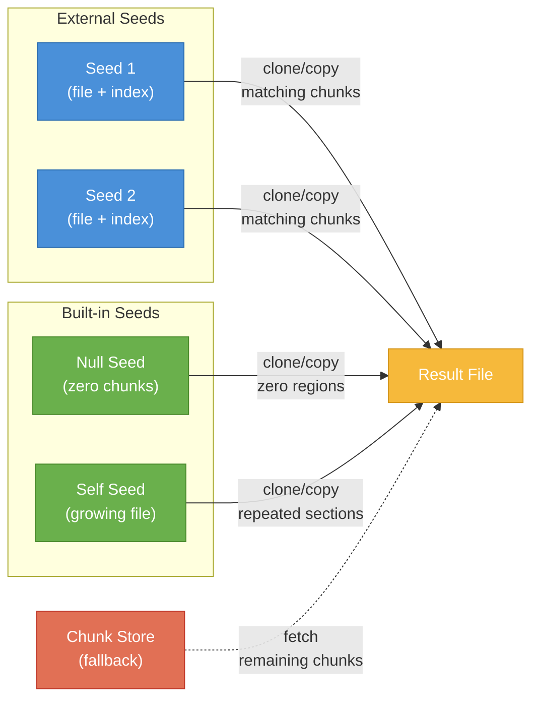

# Concepts

## Terminology

| Term | Description |
| --- | --- |
| **chunk** | A section of data from a file, typically 16KB-256KB. Identified by the SHA512-256 checksum of its uncompressed data. Stored compressed with zstd (`.cacnk` extension). Boundaries are determined by a [rolling hash algorithm](http://0pointer.net/blog/casync-a-tool-for-distributing-file-system-images.html). |
| **chunk store** | Location (local or remote) that stores chunks. Can be a local directory, or accessed via HTTP, S3, GCS, SFTP, or SSH. |
| **index** | Data structure mapping chunk IDs to byte offsets within a file. A small representation of a much larger file. Produced by `make`. Given an index and a chunk store, the original file can be reassembled or FUSE-mounted. |
| **index store** | Location for index files. Can be local, SFTP, S3, GCS, or HTTP. |
| **catar** | Archive of a directory tree, similar to tar (`.catar` extension). |
| **caidx** | Index file of a chunked catar archive. |
| **caibx** | Index of a chunked regular blob. |

## Parallel Chunking

One of the significant differences to casync is that desync attempts to make chunking faster by utilizing more CPU resources, chunking data in parallel. Depending on the chosen degree of concurrency, the file is split into N equal parts and each part is chunked independently. While the chunking of each part is ongoing, part1 is trying to align with part2, and part3 is trying to align with part4 and so on. Alignment is achieved once a common split point is found in the overlapping area. If a common split point is found, the process chunking the previous part stops, e.g. part1 chunker stops, part2 chunker keeps going until it aligns with part3 and so on until all split points have been found. Once all split points have been determined, the file is opened again (N times) to read, compress and store the chunks.

While in most cases this process achieves significantly reduced chunking times at the cost of CPU, there are edge cases where chunking is only about as fast as upstream casync (with more CPU usage). This is the case if no split points can be found in the data between min and max chunk size as is the case if most or all of the file consists of 0-bytes. In this situation, the concurrent chunking processes for each part will not align with each other and a lot of effort is wasted.

The speedup scales with the number of cores made available through `-n`, since the parts are chunked concurrently — reaching the higher multiples needs a correspondingly high core count. On a 4-core machine, `make` measured between 1.8x and 3.6x faster than casync 2 depending on the data, with both tools writing zstd-compressed chunks to a local store. Run single-threaded (`-n 1`), desync is in the same range as casync and can be slightly slower: its rolling hash is pure Go against casync's optimized C, so the advantage comes from concurrency rather than from a faster inner loop.

| Command | Mostly/All 0-bytes | Typical data |
| --- | --- | --- |
| `make` | Less benefit from parallelism — the concurrent chunkers can't align, so some work is wasted | Fast — parallel chunking |
| `extract` | Extremely fast — effectively the speed of a `truncate()` syscall | Fast — done in parallel, usually limited by I/O |

While casync supports very small min chunk sizes, optimizations in desync require min chunk sizes of at least the window size of the rolling hash used (currently 48 bytes). The tool's default chunk sizes match the defaults used in casync: min 16KB, avg 64KB, max 256KB.

## Seeds and Reflinks

Copy-on-write filesystems such as Btrfs and XFS support cloning of blocks between files in order to save disk space as well as improve extraction performance. To utilize this feature, desync uses several seeds to clone sections of files rather than reading the data from chunk stores and copying it in place:

- **Null Seed** — a built-in seed for chunks of max size containing only 0 bytes. This can significantly reduce disk usage of files with large 0-byte ranges, such as VM images, effectively turning an eager-zeroed VM disk into a sparse disk.
- **Self Seed** — as chunks are written to the destination file, the file itself becomes a seed. If a chunk or series of chunks appears again later in the file, it is cloned from the position written previously, saving storage for files with repetitive sections.
- **File Seeds** — seed files and their indexes can be provided when extracting. For example, `image-v1.vmdk` and `image-v1.vmdk.caibx` can be used as seed for extracting `image-v2.vmdk`. The additional disk space required will be only the delta between the two versions.

Even if cloning is not available, seeds are still useful. desync automatically determines if reflinks are available (and the block size used in the filesystem). If cloning is not supported, sections are copied instead of cloned. Copying still improves performance and reduces the load created by retrieving chunks over the network and decompressing them.

## Tar Interoperability

In addition to packing local filesystem trees into catar archives, desync can read standard tar archive streams. Various tar formats such as GNU and BSD tar are supported. See the Go [archive/tar](https://pkg.go.dev/archive/tar) package for details on supported formats. When reading from tar archives, the content is not re-ordered and written to the catar in the same order. Since the catar format does not support hardlinks, the input tar stream needs to follow hardlinks for desync to process them correctly. See the `--hard-dereference` option in the tar utility.

catar archives can also be extracted to GNU tar archive streams. All files in the output stream are ordered the same as in the catar.
