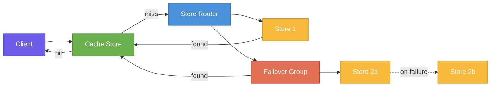

# Store Backends

## Capabilities

| Operation | Local | S3 | GCS | HTTP | SFTP | SSH (casync protocol) | OCI registry |
| --- | :---: | :---: | :---: | :---: | :---: | :---: | :---: |
| Read chunks | yes | yes | yes | yes | yes | yes | yes |
| Write chunks | yes | yes | yes | yes | yes | no | yes |
| Use as cache | yes | yes | yes | yes | yes | no | yes |
| Prune | yes | yes | yes | no | yes | no | yes |
| Verify | yes | no | no | no | no | no | no |
| Store indexes | yes | yes | yes | yes | yes | no | yes |

## Store Architecture



## Chaining and Caching

One of the main features of desync is the ability to combine/chain multiple chunk stores of different types and also combine it with a cache store. Stores are chained in the command line like so: `-s <store1> -s <store2> -s <store3>`. A chunk will first be requested from `store1`, and if not found there, the request will be routed to `store2` and so on. Typically, the fastest chunk store should be listed first to improve performance.

It is also possible to combine multiple chunk stores with a cache. In most cases the cache would be a local store, but that is not a requirement. When combining stores and a cache like so: `-s <store1> -s <store2> -c <cache>`, a chunk request will first be routed to the cache store, then to store1 followed by store2. Any chunk that is not yet in the cache will be stored there upon first request.

The `-c <store>` option can be used to either specify an existing store to act as cache or to populate a new store. Whenever a chunk is requested, it is first looked up in the cache before routing the request to the next (possibly remote) store. Any chunks downloaded from the main stores are added to the cache. In addition, when a chunk is read from the cache and it is a local store, mtime of the chunk is updated to allow for basic garbage collection based on file age. The cache store is expected to be writable. If the cache contains an invalid chunk (checksum does not match the chunk ID), the operation will fail. Invalid chunks are not skipped or removed from the cache automatically. `verify -r` can be used to evict bad chunks from a local store or cache.

## Failover Groups

Given stores with identical content (same chunks in each), it is possible to group them in a way that provides resilience to failures. Store groups are specified in the command line using `|` as separator in the same `-s` option. For example using `-s "http://server1/|http://server2/"`, requests will normally be sent to `server1`, but if a failure is encountered, all subsequent requests will be routed to `server2`. There is no automatic fail-back. A failure in `server2` will cause it to switch back to `server1`. Any number of stores can be grouped this way. Note that a missing chunk is treated as a failure immediately, no other servers will be tried, hence the need for all grouped stores to hold the same content.


## Compressed vs Uncompressed

By default, desync reads and writes chunks in compressed form to all supported stores. This is in line with upstream casync's goal of storing in the most efficient way. It is however possible to change this behavior by providing desync with a config file (see [Configuration](configuration.md)). Disabling compression and storing chunks uncompressed may reduce latency in some use-cases and improve performance. desync supports reading and writing uncompressed chunks to SFTP, S3, HTTP and local stores and caches. If more than one store is used, each of those can be configured independently, for example it's possible to read compressed chunks from S3 while using a local uncompressed cache for best performance. However, care needs to be taken when using the `chunk-server` command and building chains of chunk store proxies to avoid shifting the decompression load onto the server (it's possible this is actually desirable).

In the setup below, a client reads chunks from an HTTP chunk server which itself gets chunks from S3.

```text
<Client> ---> <HTTP chunk server> ---> <S3 store>
```

If the client configures the HTTP chunk server to be uncompressed (`chunk-server` needs to be started with the `-u` option), and the chunk server reads compressed chunks from S3, then the chunk server will have to decompress every chunk that's requested before responding to the client. If the chunk server was reading uncompressed chunks from S3, there would be no overhead.

Compressed and uncompressed chunks can live in the same store and don't interfere with each other. A store that's configured for compressed chunks by configuring it client-side will not see the uncompressed chunks that may be present. `prune` and `verify` too will ignore any chunks written in the other format. Both kinds of chunks can be accessed by multiple clients concurrently and independently.


## Remote Indexes

Indexes can be stored and retrieved from remote locations via SFTP, S3, GCS, HTTP, and OCI registries. Storing indexes remotely is optional and deliberately separate from chunk storage. While it's possible to store indexes in the same location as chunks in the case of SFTP, S3 and OCI registries, this should only be done in secured environments. The built-in HTTP chunk store (`chunk-server` command) can not be used as index server. Use the `index-server` command instead to start an index server that serves indexes and can optionally store them as well (with `-w`).

Using remote indexes, it is possible to use desync completely file-less. For example when wanting to share a large file with `mount-index`, one could read the index from an index store like this:

```text
desync mount-index -s http://chunk.store/store http://index.store/myindex.caibx /mnt/image
```

No file would need to be stored on disk in this case.
